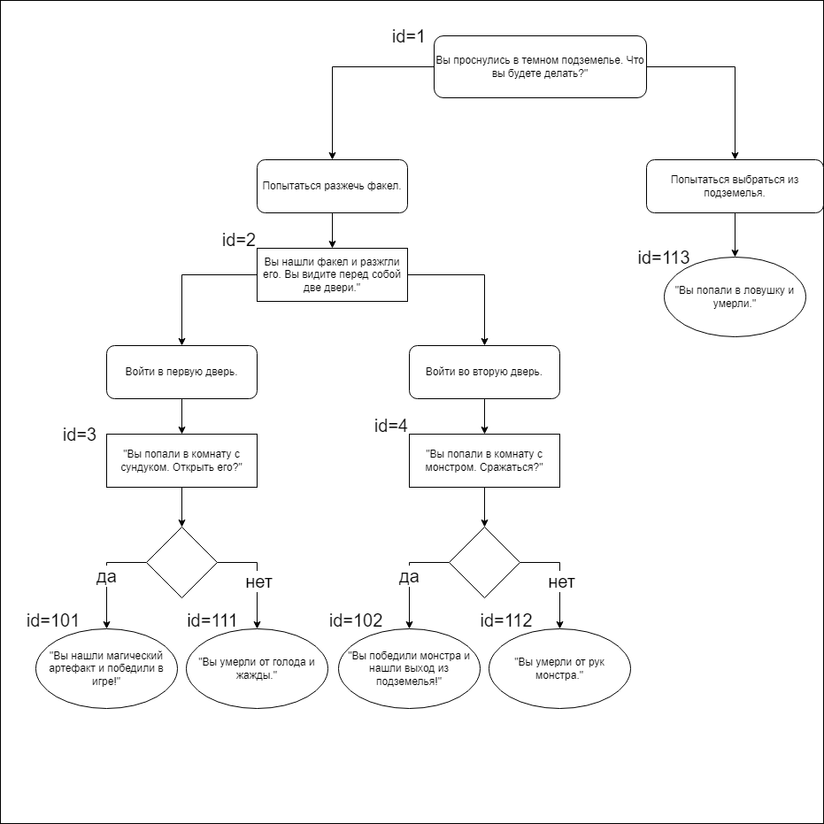

# Quest Game Web Application

Welcome to the Quest Game web application! This is a simple web-based text adventure game where you embark on exciting quests, make choices, and experience different outcomes based on your decisions.

## Getting Started

### Prerequisites

Before you get started, make sure you have the following prerequisites:

- Java Development Kit (JDK) 11 or higher
- Apache Maven
- Apache Tomcat 10.1.12
- A compatible web browser

### Installation

1. Clone the repository to your local machine:

   ```shell
   git clone https://github.com/Kuzya-06/Quest.git
2. Navigate to the project directory:
    ```shell
   cd quest
3. Build the project using Maven:
    ```shell
    mvn clean install

4. Deploy the generated WAR file to your Apache Tomcat server.

5. Start Apache Tomcat.

6. Open your web browser and go to http://localhost:8080/ to begin your adventure.
---
### Gameplay
In the Quest Game, you'll find yourself in various scenarios, each with its own unique challenges. You'll need to make choices that affect the outcome of the story. Your decisions matter, so choose wisely to reach your objectives!

### Customization
- It is planned to connect the database in the future.
- In the "QuestionnaireRepos" class, the id, the question, the first answer, the transition id after the first answer, the second answer, the transition id after the second answer are set. 
- Questions are set for id < 100. For "QuestionnaireAnswerRepo" from 101 to 109, a winning text is set, and over 110 a text with a loss.
### Technologies Used
- Java Servlets and JSP for web development
- Bootstrap for responsive web design

Enjoy your adventure in the Quest Game!

